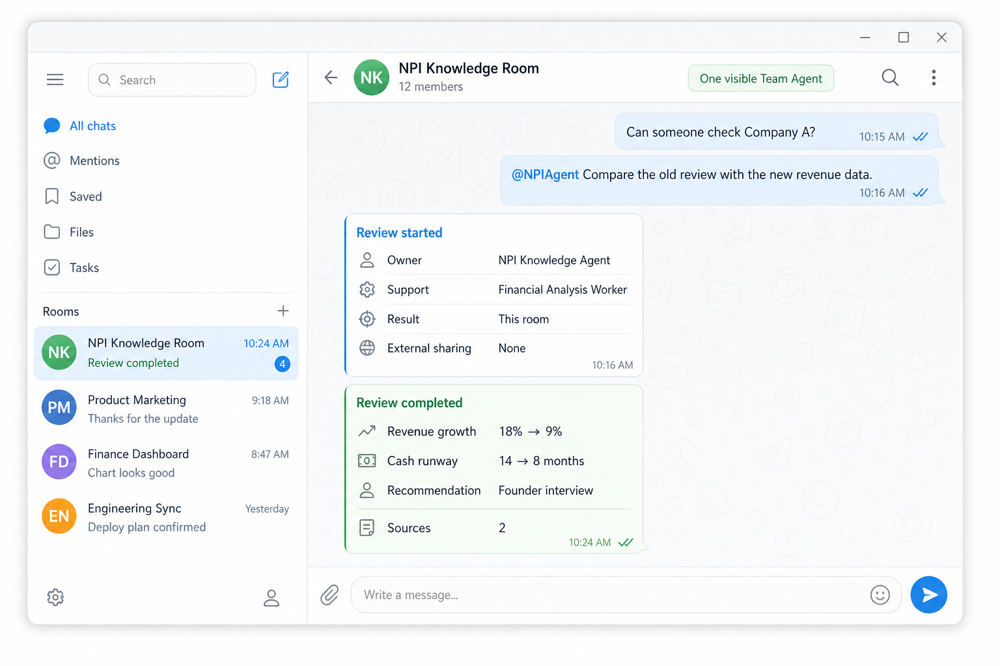
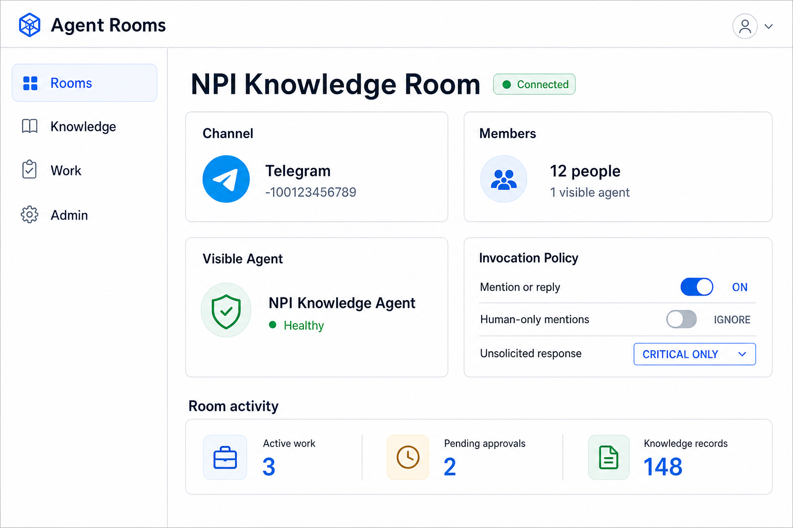
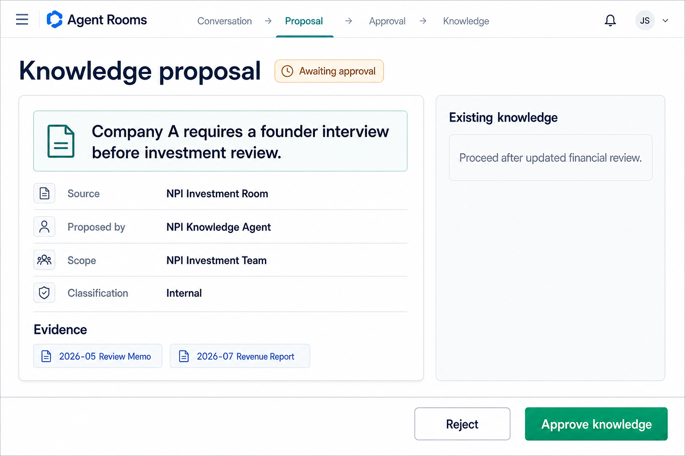

# Agent Rooms

> An open control plane for human–agent collaboration in the team rooms you already use.

[](LICENSE)
[](#project-status)

Agent Rooms connects existing communication spaces—Telegram groups, Slack channels, Microsoft Teams, Discord, email, and the web—to governed AI agents, shared knowledge, background work, approvals, artifacts, and audit trails.

It is **not another chat app**, **not an agent org-chart simulator**, and **not a replacement for agent runtimes**. It is the organizational layer that remains stable while channels, models, and agent frameworks change.

> **The Room is durable. The agents are replaceable.**

## Project status

Agent Rooms is currently a **public design draft**. This repository defines the problem, principles, proposed domain model, runtime boundary, and first MVP. It does not yet contain a production-ready implementation.

We are looking for collaborators working on:

- organizational AI and team agents;
- identity, authorization, and audit;
- knowledge provenance and correction;
- agent-runtime interoperability;
- Telegram, Slack, Teams, and other communication adapters;
- reliable background execution.

## What it looks like

### 1. Work from the room you already use

Humans talk normally. Mention the visible Team Agent when work is needed; background workers stay behind the interface and the result returns with sources.



### 2. Govern the Room—not an agent org chart

The control plane connects the channel, people, visible agent, invocation policy, knowledge, work, and approvals.



### 3. Let knowledge compound safely

Routine, sourced knowledge can be promoted automatically. Sensitive, conflicting, or consequential knowledge enters an approval flow like the example below.



> These are product-direction mockups, not screenshots of a working implementation.

## Why Agent Rooms?

Most agent systems begin with the agent:

- Which agent should the user call?
- How do agents delegate to each other?
- What does the agent org chart look like?
- Which framework owns the workflow?

Organizations begin somewhere else:

- Who is in this room?
- What can they access?
- What work was requested?
- Which sources support the answer?
- Who approved the decision?
- Where is the result?
- What crossed an organizational boundary?

Agent Rooms makes the **organizational room** the primary unit of collaboration, authority, knowledge, and accountability.

Humans select the organizational context. The visible Team Agent selects the technical execution path.

## AI–human organizational patterns

There is no single correct structure for every kind of work. These are the most common patterns and the trade-offs behind the Room approach.

### 1. Personal-agent mesh

```text
Person A ↔ Personal Agent A ─┐
Person B ↔ Personal Agent B ─┼─ agent-to-agent coordination
Person C ↔ Personal Agent C ─┘
```

Each person speaks only with their own agent. The personal agents communicate on their behalf.

**Pros**

- simple and private individual experience;
- strong personalization;
- each person controls what their agent shares;
- useful for confidential preparation and individual productivity.

**Cons**

- every human idea passes through a summarizing proxy;
- each agent sees only a narrow slice of the shared situation;
- inspiration, disagreement, tone, and tacit context are lost in handoffs;
- agents can mix projects or relationships while relaying context;
- no participant—including an agent—experiences the full group conversation;
- agent-to-agent traffic can become complex while remaining invisible to humans.

**Observed failure mode:** the workflow looks simple, but the shared field of view becomes too limited. One agent speaks for other agents, summaries become lossy, and contexts blur together.

### 2. One central organization agent

```text
Person A ─┐
Person B ─┼→ Organization Agent
Person C ─┘
```

Everyone talks to a single organization-wide agent.

**Pros**

- one interface and one broad organizational memory;
- simple discovery;
- fewer agent-to-agent handoffs;
- easy to establish a recognizable institutional identity.

**Cons**

- becomes a bottleneck and single point of failure;
- unrelated teams and projects can contaminate one another's context;
- permissions become dangerously broad;
- the agent may not know which social or decision context currently applies;
- difficult to preserve confidentiality between teams.

### 3. Visible specialist-agent swarm

```text
People + Research Agent + Finance Agent + Legal Agent + Document Agent
                          in one shared channel
```

Humans interact directly with several specialist agents in the same space.

**Pros**

- expertise is visible and directly addressable;
- less hidden delegation;
- specialists can explain or challenge one another;
- useful for expert operations teams that understand the agent topology.

**Cons**

- high AI-message volume and notification fatigue;
- humans must know which agent to call;
- overlapping answers and unclear accountability;
- agent identities can dominate the social space;
- the room becomes an agent console rather than a human workplace.

### 4. Workflow- or Board-first organization

```text
People → Forms / Board / Workflow Engine → Agents → Tasks and Artifacts
```

Work begins as structured tickets rather than conversation.

**Pros**

- reliable state, ownership, deadlines, and audit;
- good for repeatable and regulated processes;
- easier retries, recovery, and cost accounting;
- clear machine-readable inputs and outputs.

**Cons**

- people must leave their natural conversational environment;
- spontaneous ideas and evolving context are poorly captured;
- setup cost is high for ambiguous creative work;
- the workflow can become more important than the collaboration.

### 5. Room-based Team Agent — recommended default

```text
┌─────────────────────────────────────┐
│ Room                                │
│                                     │
│ People ↔ one visible Team Agent     │
│          └→ background specialists  │
└─────────────────────────────────────┘
```

A group of people shares one visible Team Agent inside a bounded Room. The agent can listen to the shared conversation according to Room policy, gather the group's inspirations and insights, and turn them into work and artifacts. Specialist agents remain behind the interface.

**Pros**

- the agent sees the same shared context as the group;
- human ideas combine before being compressed into private summaries;
- one coherent interface keeps agent noise low;
- Room boundaries separate projects, permissions, and knowledge;
- collective creativity can accumulate into shared artifacts and knowledge;
- people remain visible to one another instead of communicating through proxies.

**Cons**

- the agent must avoid interrupting ordinary human conversation;
- sensitive personal context cannot be assumed to belong in the Room;
- large or poorly scoped Rooms can still overload context;
- cross-Room knowledge needs explicit provenance and policy;
- one visible agent can become a bottleneck unless background work is well designed.

An agent may be invited to many Rooms, but every Room receives an isolated session, membership, permission set, and knowledge scope. Shared learning moves between Rooms only through governed organizational knowledge—not accidental context blending.

### 6. Hybrid personal agents + Room agents

```text
Person ↔ Personal Agent
   │
   └────────→ Shared Room ↔ Team Agent
```

Personal agents support private thinking; Room agents support collective work.

**Pros**

- preserves private assistance without making personal agents the sole representatives;
- individuals can prepare privately, then contribute directly to the group;
- shared work remains grounded in the actual Room conversation;
- likely the strongest long-term model for complex organizations.

**Cons**

- handoffs require clear consent and provenance;
- private memory must never leak automatically into Room context;
- users need to understand whether they are speaking privately or organizationally;
- more identities and surfaces increase operational complexity.

### Why Rooms are the current best bet

The Room model is not valuable because it adds another chatbot. It is valuable because it creates a shared field of attention:

> People contribute directly, one Team Agent experiences the collective context, and many interchangeable agents can execute behind it without taking over the conversation.

The visible Team Agent may run in Hermes, OpenClaw, a managed cloud runtime, a desktop application, or a phone with an embedded local model. The organizational structure remains the same.

## The basic model

```text
Telegram / Slack / Teams / Web
              │
              ▼
┌─────────────────────────────────┐
│              Room               │
│                                 │
│  People · Visible Team Agent    │
│  Knowledge · Work · Decisions   │
│  Artifacts · Membership         │
│  Permissions · Approvals        │
└────────────────┬────────────────┘
                 │ governed invocation
                 ▼
┌─────────────────────────────────┐
│       Background Runtimes       │
│                                 │
│  Research · Data · Code         │
│  Documents · Browser · Search   │
└─────────────────────────────────┘
```

The same Room may eventually have multiple communication surfaces. A Telegram group is therefore a **Channel Binding**, not the Room itself.

```text
Organization
└── Room
    ├── Memberships and grants
    ├── Knowledge scope
    ├── Work and decisions
    ├── Approvals and artifacts
    ├── Visible Team Agent
    └── Channel Bindings
        ├── Telegram group
        ├── Slack channel
        └── Web room
```

## Design principles

### 1. Rooms before agents

The Room is the durable organizational context. Agent identities and runtimes can be added, replaced, or removed without migrating the organization's knowledge, authority, and work history.

### 2. One coherent human interface

A Room starts with one visible Team Agent. That agent may invoke specialist workers, but humans should not have to select among a collection of technical agents.

### 3. Existing channels first

Teams should be able to work from the communication tools they already use. A new dashboard may help administrators, but it should not become mandatory for ordinary collaboration.

### 4. The Board is a ledger, not the workplace

Conversation remains the primary collaboration surface. A durable work ledger records ownership, status, deadlines, approvals, artifacts, retries, recovery, and cost.

### 5. Knowledge compounds automatically—with review at risk boundaries

The system should detect reusable knowledge continuously, then apply deterministic source, permission, conflict, sensitivity, and risk checks.

```text
Conversation
→ Candidate detected
→ Sources and permissions checked
→ Conflict and risk scored
→ Auto-publish OR request approval
→ Revalidate, supersede, or expire over time
```

Routine facts, sourced summaries, terminology, and resolved questions can become organizational knowledge automatically. Conflicting information, sensitive material, policies, and consequential decisions require authorized review.

### 6. Policy is deterministic

Identity, permissions, budgets, invocation eligibility, and approval requirements must be enforced by software. They must not depend on an LLM deciding to follow a prompt.

### 7. Every boundary crossing leaves a receipt

Cross-room transfers, external sends, restricted retrieval, and consequential actions must be explicit, authorized, and auditable.

### 8. Agent runtimes are interchangeable

Agent Rooms standardizes the organizational envelope and observable execution lifecycle—not the internal reasoning architecture of every agent.

## Core domain objects

| Object | Purpose |
|---|---|
| `Organization` | Administrative and policy boundary |
| `Person` | Stable human identity independent of channel accounts |
| `AgentIdentity` | Stable identity of a visible or background agent |
| `Room` | Organizational context for membership, policy, knowledge, and work |
| `ChannelBinding` | Maps a Telegram group, Slack channel, or other surface to a Room |
| `Membership` | Connects a person or agent to a Room with roles and grants |
| `RoomAgent` | Declares the visible Team Agent and permitted worker relationships |
| `KnowledgeRecord` | Versioned, sourced, classified organizational knowledge |
| `KnowledgeProposal` | Proposed addition, correction, or supersession awaiting review |
| `WorkItem` | Durable unit of requested work and its execution state |
| `Decision` | Authorized conclusion with scope, evidence, and decision maker |
| `Artifact` | Registered output such as a document, dataset, report, or code change |
| `Approval` | Human authorization for a governed transition or action |
| `TransferReceipt` | Record of an authorized cross-room or external handoff |
| `AuditEvent` | Append-only record of significant actions and state transitions |

A personal agent profile or an agent organizational chart is intentionally **not** a foundational object.

## Example Room configuration

```yaml
room:
  id: npi-investment
  organization_id: npi
  display_name: NPI Investment

  bindings:
    - id: telegram-npi-investment
      type: telegram
      external_id: "-100123456789"
      invocation_policy:
        agent_mention: true
        reply_to_agent: true
        human_mentions: ignore
        unsolicited_response: critical_only

  memberships:
    - subject: person:jehyun-park
      roles: [partner]
    - subject: person:jaehun-wi
      roles: [member]
    - subject: person:hohyon-ryu
      roles: [member]

  visible_agent:
    id: agent:npi-investment
    runtime: hermes:npi-investment

  workers:
    - agent:research
    - agent:financial-analysis
    - agent:document

  knowledge_scopes:
    - npi-common
    - npi-investment
    - assigned-portfolio

  approvals:
    external_send: human
    investment_decision: role:partner
    payment: role:authorized-person
```

This format is illustrative. The specification will define a validated schema before implementation.

## Conversation behavior

### Human-only conversation

```text
@Jae-hyun Please check Company A's latest materials.
```

The agent remains silent because the message addresses another human.

### Agent invocation

```text
@NPIAgent Compare Company A's previous investment review with the new revenue data.
```

The visible Team Agent immediately acknowledges the request:

```text
Review started.

Owner: NPI Investment Agent
Support: Financial Analysis Worker
Sources: Prior review · Current revenue data
Estimated completion: 20 minutes
Result destination: This room
External sharing: None
```

The runtime may invoke workers without exposing that technical routing decision to the requester.

### Result

```text
Company A review completed.

Changes
1. Revenue growth: 18% → 9%
2. Customer concentration increased
3. Cash runway: 14 months → 8 months

Recommendation
Conduct an additional founder interview before deciding whether to proceed.

Decision requested
Should we schedule the interview?

Sources
- 2026-05 investment review memo
- 2026-07 revenue report
```

## Invocation policy

Message eligibility must be determined **before** an LLM is invoked.

A channel adapter extracts platform-specific facts:

```yaml
message_context:
  sender: telegram-user:12345
  room_binding: telegram-npi-investment
  mentions:
    - person:jehyun-park
  replies_to: null
  text: "Please review this."
```

The kernel resolves stable identities and applies Room policy:

```yaml
eligibility:
  invoke_agent: false
  reason: human_only_mention
```

This prevents unnecessary model calls and unwanted intervention in human conversation.

## Authenticated invocation envelope

Every runtime invocation should carry authenticated organizational context:

```yaml
invocation:
  id: inv_01J...
  idempotency_key: telegram:-100123456789:message:456

  actor:
    person_id: person:jehyun-park
    membership_id: membership:npi-investment:jehyun-park

  context:
    organization_id: npi
    room_id: npi-investment
    channel_binding_id: telegram-npi-investment

  agent:
    visible_agent_id: agent:npi-investment
    runtime_id: hermes:npi-investment

  grants:
    - knowledge.read:npi-common
    - knowledge.read:npi-investment
    - work.create:npi-investment

  request:
    text: "Compare the previous review with the current revenue data."

  delivery:
    destination: originating-room
    external_send: prohibited
```

Identity and grants must come from trusted system state—not prompt text supplied by a person or an agent.

## Knowledge lifecycle

A `KnowledgeRecord` has an explicit, risk-aware lifecycle:

```text
detected → evaluating ─┬→ approved automatically → superseded / expired
                       └→ awaiting review → approved / rejected
```

Low-risk promotion is automatic when sources, permissions, classification, confidence, and conflict checks pass. The decision records the policy version and evidence that permitted automatic publication.

A record should include:

- source and source location;
- author or proposing agent;
- promotion mode: automatic or reviewed;
- approving policy version or human approver;
- confidence and risk classification;
- version and effective date;
- security classification;
- Room and organizational scope;
- status and supersession relationship;
- correction history;
- index synchronization state.

### Corrections

A correction does not silently overwrite history. It creates a `KnowledgeProposal` that:

1. identifies the challenged record;
2. preserves both old and proposed versions;
3. provides evidence;
4. evaluates conflict, sensitivity, and consequence;
5. auto-promotes when policy permits, otherwise names the required approver;
6. supersedes the old record only after authorization;
7. invalidates or rebuilds derived search indexes.

## Work lifecycle

A background task becomes a durable `WorkItem`:

```text
proposed
→ accepted
→ queued
→ running
→ awaiting_approval
→ completed
```

Alternative terminal states:

```text
cancelled · failed · expired · rejected
```

A WorkItem distinguishes:

- requester;
- accountable owner;
- executing agent runtime;
- approving person or role;
- originating Room;
- result destination;
- visible and restricted artifacts.

Retries must be idempotent. Worker crashes and gateway restarts must not lose accepted work or create duplicate results.

## Cross-Room transfers

A Room Agent may request work from another Room only through an authorized transfer.

```text
NPI Investment Room
        │
        │ TransferReceipt
        ▼
NPI Legal & Operations Room
```

A receipt records:

- requester and sending Room;
- destination Room;
- disclosed text, context, and artifacts;
- authorization decision;
- destination acceptance;
- resulting WorkItem;
- delivery and failure state;
- replay protection.

Both Rooms receive a human-readable receipt. No private agent should secretly move organizational information between Rooms.

## Agent-runtime interface

A runtime adapter exposes capabilities and an observable lifecycle:

```python
from typing import Protocol

class AgentRuntime(Protocol):
    def capabilities(self) -> "AgentCapabilities": ...
    def execute(self, request: "InvocationEnvelope") -> "RunHandle": ...
    def status(self, run_id: str) -> "RunStatus": ...
    def cancel(self, run_id: str) -> "CancelResult": ...
    def collect_artifacts(self, run_id: str) -> list["Artifact"]: ...
    def usage(self, run_id: str) -> "UsageRecord": ...
```

Possible adapters include:

- Hermes Agent;
- Claude Agent SDK;
- OpenAI Agents SDK;
- LangGraph;
- Google ADK;
- custom HTTP agents;
- deterministic scripts and workers.

The adapter executes. The kernel authorizes and records.

## Kernel and adapters

### Kernel responsibilities

- stable identities and memberships;
- Room and Channel Binding state;
- grants and policy decisions;
- invocation eligibility;
- Knowledge lifecycle and provenance;
- WorkItem state machine;
- approvals, decisions, and artifacts;
- transfer protocol;
- idempotency and recovery;
- append-only audit events;
- transactional event/outbox delivery.

### Adapter responsibilities

- parsing and publishing platform messages;
- translating mentions, replies, files, and threads;
- invoking, cancelling, and inspecting agent runtimes;
- integrating search and storage backends;
- integrating identity providers and secret managers;
- reporting usage and collecting artifacts.

Adapters must not become alternate policy engines.

## Security model

Agent Rooms assumes that agent output can be incorrect and external content can be hostile.

Key requirements:

- deterministic authorization before retrieval and action;
- item-level access control for restricted knowledge;
- least-privilege grants for workers;
- no privilege expansion through delegation;
- explicit approval for consequential actions;
- content and metadata separation in audit storage;
- configurable retention, redaction, export, and deletion;
- secrets referenced by handles rather than embedded in prompts;
- replay protection and idempotency for channel updates;
- provenance preserved across retrieval, summarization, and handoff.

“Full audit” does not mean every person can read every payload. Audit access is itself governed.

For private vulnerability reports, see [SECURITY.md](SECURITY.md).

## Minimal administration surface

The long-term admin experience can remain small:

### Rooms

- connected channels;
- people and memberships;
- visible Team Agent;
- knowledge scope;
- invocation policy.

### Knowledge

- approved organizational knowledge;
- sources and versions;
- security classifications;
- corrections and pending approvals.

### Work

- active and blocked WorkItems;
- human and agent ownership;
- deadlines, retries, and results;
- registered artifacts.

### Admin

- roles and grants;
- runtime health;
- usage and cost;
- audit and retention controls.

## NPI Knowledge Room MVP

The first deployment should contain exactly one Room:

```text
NPI Knowledge Room
├── NPI employees
├── NPI Knowledge Agent
├── Existing NPI Knowledge Broker
├── Company documents, policies, and prior decisions
└── Questions, corrections, and knowledge proposals
```

### First capabilities

1. Connect one existing Telegram group.
2. Respond only to `@NPIAgent` or replies to the agent.
3. Remain silent for messages that mention only humans.
4. Search approved shared knowledge.
5. Include sources in every factual answer.
6. Filter retrieval by membership and classification.
7. Register corrections as proposals.
8. Run long tasks as durable background WorkItems.
9. Return results to the originating Room.
10. Audit every accepted request, state transition, and result.

### Explicitly deferred

- general-purpose Board UI;
- multiple visible agents in one Room;
- personal agents;
- arbitrary cross-Room routing;
- autonomous agent negotiation;
- visual agent org charts;
- generic workflow builders;
- organization-wide semantic search;
- broad runtime support before the contract is proven.

## MVP acceptance tests

The MVP is not complete until it handles these cases:

1. An unauthorized person requests restricted material.
2. An answer would combine authorized and unauthorized sources.
3. Telegram delivers the same update twice.
4. A worker crashes during execution.
5. The gateway restarts before publishing a result.
6. A person mentions another person but not the agent.
7. A correction conflicts with approved knowledge.
8. Membership is revoked while background work is running.
9. An agent attempts an external send without approval.
10. A result is too large for the channel and must become an Artifact.

## Success measures

For the first four weeks, measure:

- weekly active users;
- questions per employee;
- reduction in repeated questions;
- percentage of factual answers with sources;
- incorrect-answer and correction rates;
- approved Knowledge proposals;
- median and tail response time;
- unnecessary agent interventions;
- usage relative to personal agents;
- unauthorized retrieval attempts correctly denied;
- duplicate messages and duplicate WorkItems prevented.

## Non-goals

Agent Rooms is not intended to:

- define how an agent reasons internally;
- require a particular model or framework;
- expose every specialist agent to humans;
- ingest every conversation into permanent memory;
- replace Telegram, Slack, Teams, or email;
- let LLM prompts substitute for authorization;
- score employees through agent telemetry;
- make consequential decisions without accountable human approval.

## Proposed repository structure

```text
agent-rooms/
├── README.md
├── LICENSE
├── CONTRIBUTING.md
├── SECURITY.md
├── specs/
│   ├── room.schema.json
│   ├── invocation.schema.json
│   ├── work-item.schema.json
│   └── events.md
├── kernel/
├── adapters/
│   ├── channels/
│   │   └── telegram/
│   └── runtimes/
│       ├── hermes/
│       └── http/
├── examples/
│   └── npi-knowledge-room/
└── tests/
    ├── authorization/
    ├── invocation/
    └── recovery/
```

This is a target structure, not a claim about the current repository contents.

## Roadmap

### Phase 0 — Specification

- settle vocabulary and invariants;
- define JSON Schemas;
- define invocation and runtime contracts;
- model Knowledge and WorkItem state machines;
- publish threat model and acceptance scenarios.

### Phase 1 — Single Room reference implementation

- PostgreSQL-backed kernel;
- Telegram adapter;
- Hermes runtime adapter;
- mention/reply invocation policy;
- approved Knowledge retrieval with citations;
- durable background WorkItems;
- append-only audit events.

### Phase 2 — Interoperability proof

- generic HTTP runtime adapter;
- second channel adapter;
- capability negotiation;
- conformance test suite;
- export and migration tools.

### Phase 3 — Governed organizational workflows

- cross-Room transfer receipts;
- richer approval policies;
- enterprise identity integrations;
- retention and audit administration;
- deployment and isolation reference patterns.

## Open-source strategy

Agent Rooms should remain useful without a hosted service. The protocol, schemas, kernel, reference adapters, and conformance tests should be open.

A sustainable ecosystem may grow around:

- managed hosting;
- enterprise identity and compliance integrations;
- premium operational tooling;
- supported channel and runtime adapters;
- migration and deployment services;
- governance templates and evaluation suites.

The moat is not hidden-agent orchestration. It is trustworthy organizational state and compatibility across changing agent runtimes.

## Questions we want help answering

- Which invariants must every Room implementation preserve?
- How small can the runtime contract remain without becoming a lowest-common-denominator trap?
- Should Knowledge authorization be ACL-, policy-, or capability-based?
- Which audit events need payload retention, and which need metadata only?
- How should active work react to membership or grant revocation?
- What delivery guarantees should channel adapters provide?
- How should organizations export all Room state and move between implementations?
- When does a specialist agent deserve a visible social identity?

## Contributing

This project is at the stage where careful disagreement is especially valuable.

Good first contributions include:

- concrete use cases and failure scenarios;
- domain-model critiques;
- authorization and privacy threat analysis;
- runtime-interface proposals;
- channel behavior edge cases;
- JSON Schema drafts;
- conformance and recovery tests.

Please read [CONTRIBUTING.md](CONTRIBUTING.md) before opening a pull request.

## License

Licensed under the [Apache License 2.0](LICENSE).

## One-sentence design

> Agent Rooms turns existing team chats into governed workplaces where people collaborate with one visible Team Agent backed by shared knowledge, durable work, approvals, artifacts, and interchangeable agent runtimes.
